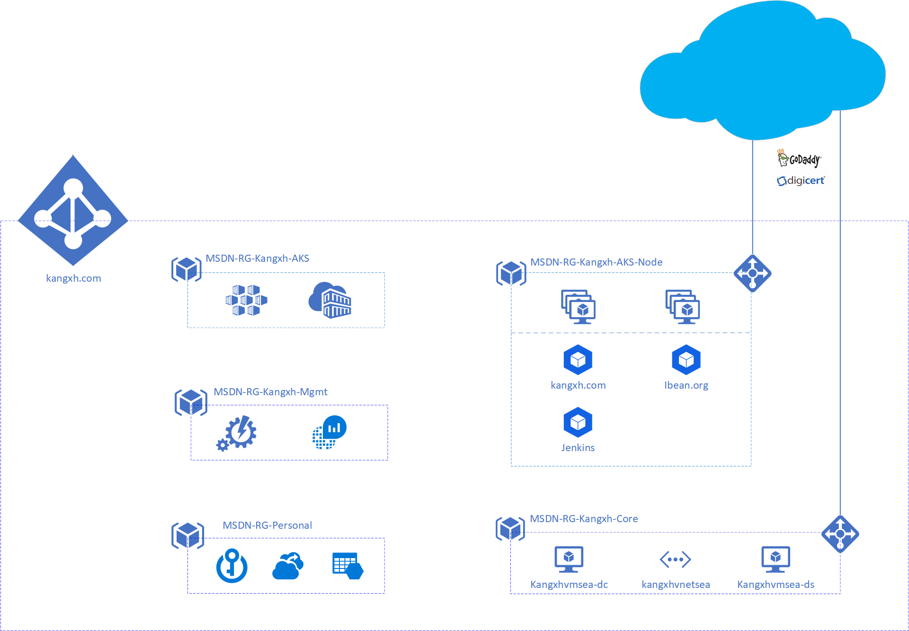

# kangxh.com

    Personal web site to host projects and code practise. 

# Identity

    1. Domain registered via bigdaddy. 
    2. Onprem DC, kangxh.local, setup in Azure SouthEast Asia region. 
    3. AAD Connect to sync to kangxh.com Domain. 
    4. ADFS enabled on OnPrem DC

# Web

    1. Use kangxhvmsea-dc to develop web site in WSL2
    2. Web site hosted on AKS container 
    3. Static content saved in Azure File 

# Architecture

