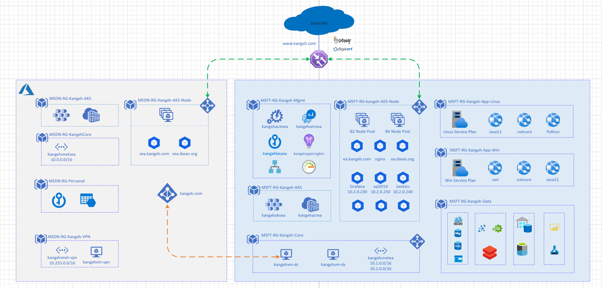

# kangxh.com

## environment setup on azure, cross three tenants: 

    AIA-CSU-ALLENK
    admin: allenk@microsoft.com  
    usage: host most costing resource, AAD, storage, vm, app service, data solution, Management, Monitor

    MSDN-ALLENK
    admin: kang_xh@hotmail.com
    usage: host personal data, BCDR
    
## naming convension

    PROJECT|Resource|Region[option]|Usage[option]
    - kangxhnlbea-core
    - kangxhvm-dc

# Identity

    1. Onprem DC, kangxh.local
    2. AAD Connect to sync to kangxh.com on MSDN. 
    3. AD FS enabled

# DevOps

    1. github repo: kangxh-xh/kangxh.com
    2. CICD with github actions.
    3. Jenkins for practise.

# Architecture

# Sample Apps

- [application Insight](https://github.com/Azure-Samples/application-insights-aspnet-sample-opentelemetry)

- [Spring Cloud on K8s](https://github.com/Azure-Samples/application-insights-aspnet-sample-opentelemetry)
